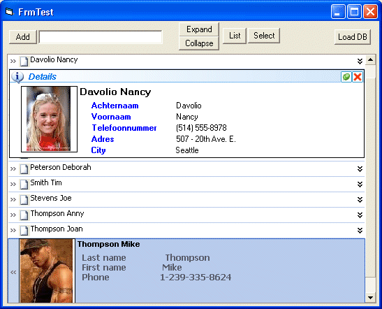



## TreeBook Control

### Description

The TreeBook Control is designed to store information, (as example contacts). There is a picture storing feature available. It is possible to store practically any information. The data inside the viewing area has a tree-like structure.
 
### More Info
 

             |
---                |---
**Submitted On**   |2006-09-07 15:06:54
**By**             |[Erwin Christiaens](https://github.com/Planet-Source-Code/PSCIndex/blob/master/ByAuthor/erwin-christiaens.md)
**Level**          |Intermediate
**User Rating**    |4.7 (28 globes from 6 users)
**Compatibility**  |VB 6\.0
**Category**       |[Custom Controls/ Forms/  Menus](https://github.com/Planet-Source-Code/PSCIndex/blob/master/ByCategory/custom-controls-forms-menus__1-4.md)
**World**          |[Visual Basic](https://github.com/Planet-Source-Code/PSCIndex/blob/master/ByWorld/visual-basic.md)
**Archive File**   |[TreeBook\_C201867982006\.zip](https://github.com/Planet-Source-Code/erwin-christiaens-treebook-control__1-66500/archive/master.zip)

